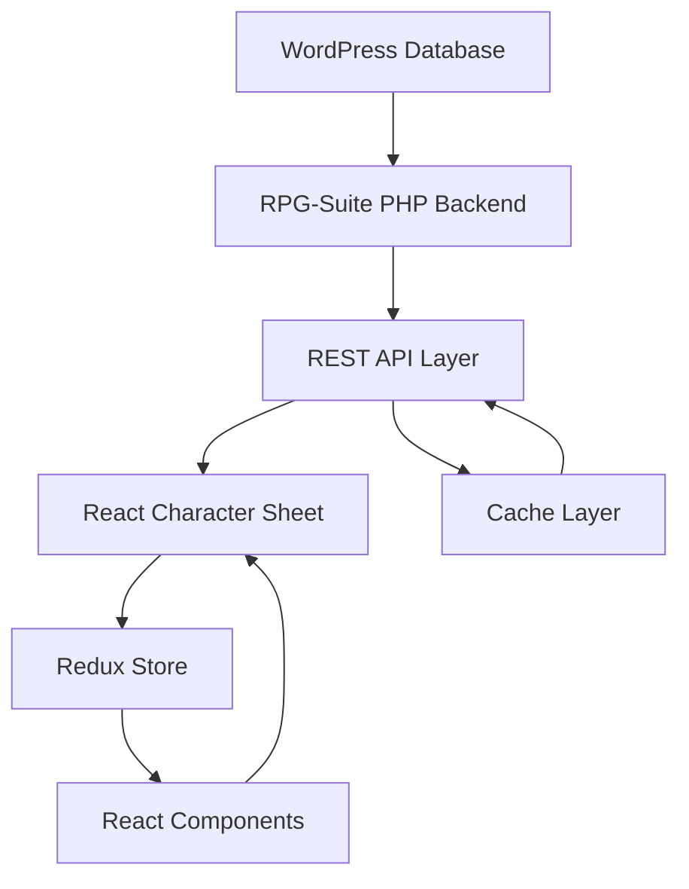

# RPG-Suite Project Replan

**Date:** 5/17/2025
**Author:** TurtleWolfe
**Repository:** https://github.com/TortoiseWolfe/RPG-Suite

## Executive Summary

This document outlines a revised architectural approach for RPG-Suite that addresses performance issues, simplifies the implementation, and considers modern technology options including React for the character sheet UI.

## Current Issues

### Critical Problems
1. **Character Switching Performance**: Character switching is unresponsive, indicating larger structural issues
2. **Missing Core Classes**: Several essential classes referenced in the main plugin are missing:
   - Character Manager
   - Event Dispatcher  
   - BuddyPress Integration
   - Die Code Utility
3. **Post Type Capability Issues**: The character post type has incorrect capability mappings preventing editing
4. **PHP/Redis Caching Inefficiencies**: Current caching strategy is not providing adequate performance

### Architectural Concerns
1. **Frontend Performance**: Character sheets are not responsive enough
2. **State Management**: No clear state management strategy for character data
3. **Build Complexity**: No clear build process for modern JavaScript assets
4. **Technology Mismatch**: Using server-side rendering for dynamic character data

## Proposed Architecture

### 1. Technology Stack Consideration

#### Option A: React-Based Character System
- **Pros**:
  - Better performance for dynamic character sheets
  - Real-time updates without page reloads
  - Modern state management (Redux/Context API)
  - Component reusability
  - Better caching strategies
- **Cons**:
  - Additional build complexity
  - Requires REST API or GraphQL endpoints
  - Learning curve for team members
  - Additional infrastructure (build process)

#### Option B: Enhanced PHP with Smart Caching
- **Pros**:
  - Simpler deployment
  - WordPress-native approach
  - No build process required
  - Easier for WordPress developers
- **Cons**:
  - Performance limitations
  - Less responsive UI
  - More server requests
  - Harder to implement real-time features

**Recommendation**: Adopt **Option A** with React for character sheets while maintaining PHP for admin and core plugin functionality.

### 2. Infrastructure Requirements

#### Docker Container for React Development
```yaml
services:
  react-builder:
    image: node:20-alpine
    volumes:
      - ./react-app:/app
    working_dir: /app
    command: npm run build
    environment:
      - NODE_ENV=production
```

#### Build Process
1. React development container for building assets
2. Webpack configuration for bundling
3. Hot module replacement for development
4. Production builds for deployment

### 3. Revised Plugin Architecture

```
RPG-Suite/
├── rpg-suite.php              # Main plugin file
├── includes/                  # PHP backend classes
│   ├── Core/                  # Core functionality
│   ├── API/                   # REST API endpoints
│   ├── Character/             # Character management
│   └── BuddyPress/           # BP integration
├── react-app/                 # React frontend
│   ├── src/
│   │   ├── components/       # React components
│   │   ├── hooks/           # Custom React hooks
│   │   ├── store/           # Redux store
│   │   └── api/             # API client
│   ├── build/               # Compiled assets
│   └── package.json
├── assets/                   # Legacy assets
└── docker/                   # Docker configs
```

### 4. Data Flow Architecture



### 5. Caching Strategy

#### Multi-Layer Caching
1. **Database Query Cache**: WordPress transients for expensive queries
2. **Object Cache**: Redis for frequently accessed objects
3. **HTTP Cache**: Cache API responses for better performance
4. **Frontend Cache**: React state management to minimize API calls

```php
// Example of improved caching
class CharacterCacheManager {
    private $cache_prefix = 'rpg_character_';
    private $cache_duration = HOUR_IN_SECONDS;
    
    public function get_character($character_id) {
        $cache_key = $this->cache_prefix . $character_id;
        
        // Try object cache first
        $character = wp_cache_get($cache_key);
        
        if (false === $character) {
            // Fallback to transient
            $character = get_transient($cache_key);
            
            if (false === $character) {
                // Finally, get from database
                $character = $this->fetch_from_database($character_id);
                
                // Store in both caches
                wp_cache_set($cache_key, $character, '', $this->cache_duration);
                set_transient($cache_key, $character, $this->cache_duration);
            }
        }
        
        return $character;
    }
    
    public function invalidate_character($character_id) {
        $cache_key = $this->cache_prefix . $character_id;
        wp_cache_delete($cache_key);
        delete_transient($cache_key);
    }
}
```

### 6. REST API Design

```php
// REST API endpoints for React frontend
add_action('rest_api_init', function() {
    register_rest_route('rpg-suite/v1', '/characters/(?P<id>\d+)', [
        'methods' => 'GET',
        'callback' => 'get_character_data',
        'permission_callback' => 'can_view_character',
        'args' => [
            'id' => [
                'validate_callback' => function($param) {
                    return is_numeric($param);
                }
            ]
        ]
    ]);
    
    register_rest_route('rpg-suite/v1', '/characters/(?P<id>\d+)/switch', [
        'methods' => 'POST',
        'callback' => 'switch_active_character',
        'permission_callback' => 'can_edit_character'
    ]);
});
```

### 7. React Component Architecture

```javascript
// Example React component structure
const CharacterSheet = () => {
    const { characterId } = useParams();
    const character = useCharacter(characterId);
    const dispatch = useDispatch();
    
    const handleSwitch = async () => {
        dispatch(switchCharacter(characterId));
    };
    
    if (!character) return <Loading />;
    
    return (
        <div className="rpg-character-sheet">
            <CharacterHeader character={character} />
            <CharacterAttributes attributes={character.attributes} />
            <CharacterInventory items={character.inventory} />
            <CharacterActions 
                onSwitch={handleSwitch}
                isActive={character.isActive}
            />
        </div>
    );
};
```

## Implementation Priority

### Phase 1: Core Fixes (Week 1)
1. Fix character post type capabilities
2. Implement missing core PHP classes
3. Basic REST API endpoints
4. Simple caching layer

### Phase 2: React Setup (Week 2)
1. Docker container for React builds
2. Basic React app structure
3. Redux store setup
4. API client implementation

### Phase 3: Character Sheet UI (Week 3-4)
1. Character display components
2. Character switching functionality
3. Real-time updates
4. Performance optimization

### Phase 4: Integration (Week 5)
1. BuddyPress profile integration
2. Admin UI enhancements
3. Migration tools
4. Documentation

## Benefits of This Approach

1. **Performance**: React provides much better performance for dynamic UIs
2. **User Experience**: Instant updates without page reloads
3. **Maintainability**: Clear separation of concerns
4. **Scalability**: Better suited for future features
5. **Modern Stack**: Attracts better developers

## Migration Path

### For Existing Installations
1. Deploy backend fixes first
2. Introduce React gradually
3. Provide fallback PHP templates
4. Migrate users incrementally

### Development Workflow
1. Use Docker for consistent environments
2. Separate frontend/backend development
3. API-first approach
4. Comprehensive testing suite

## Testing Strategy

### Unit Tests
- PHP unit tests for backend logic
- Jest tests for React components
- API endpoint testing

### Integration Tests
- BuddyPress integration
- Character management flows
- Performance benchmarks

### E2E Tests
- Cypress for user workflows
- Character creation/switching
- Profile display verification

## Documentation Requirements

### Developer Documentation
1. API reference
2. Component documentation
3. Build process guide
4. Architecture decisions

### User Documentation
1. Character management guide
2. BuddyPress integration help
3. Troubleshooting guide
4. FAQ section

## Conclusion

This replan addresses the core performance issues by:
1. Adopting modern frontend technology (React)
2. Implementing proper caching strategies
3. Creating clear separation of concerns
4. Establishing proper build and deployment processes

The React-based approach will provide the responsive character sheets needed while maintaining WordPress best practices for the backend functionality.